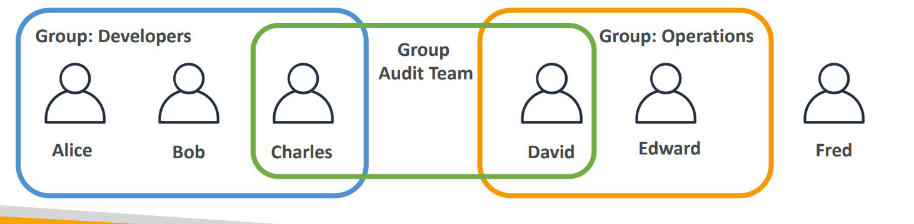

# IAM: Users & Groups
1. IAM = Identity and Access Management, <b>Global</b> service
2. Users are people within your organization, and can be grouped
3. <b>Groups</b> only contain users, not other groups
4. <b>Users</b> don’t have to belong to a group, and user can belong to multiple groups

